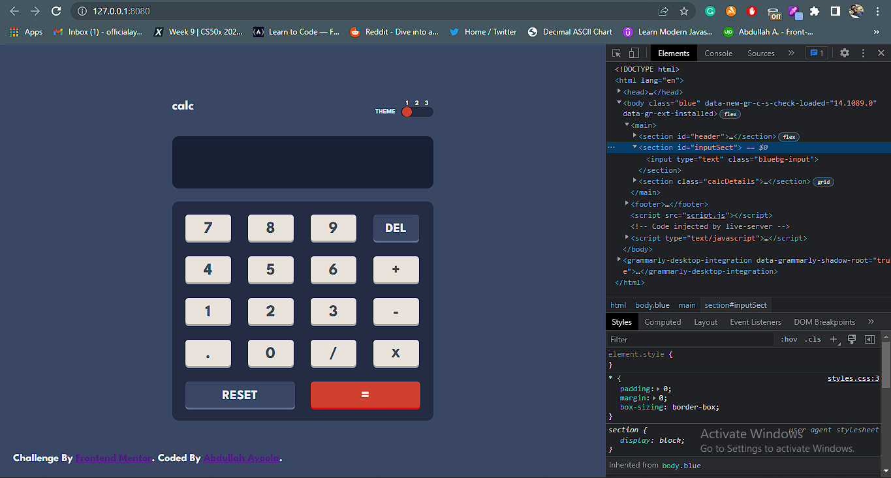
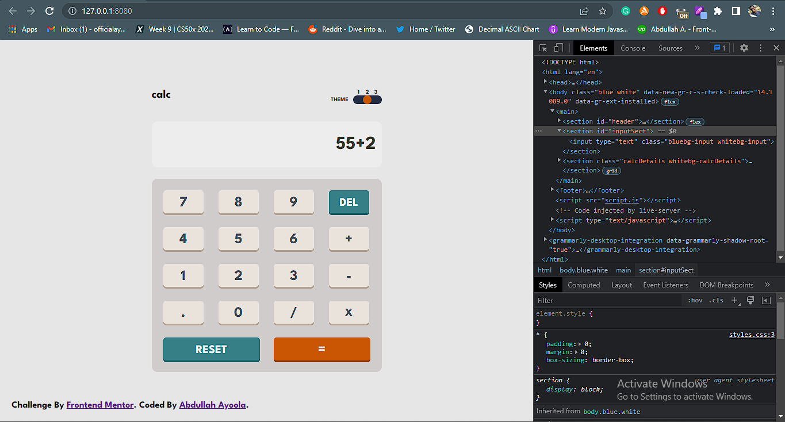
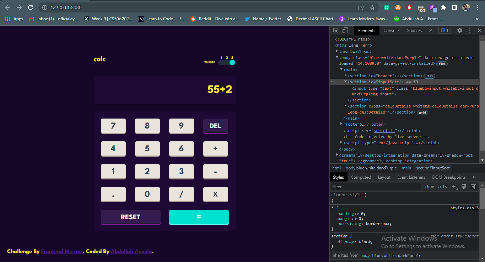

# Frontend Mentor - Calculator app solution

This is a solution to the [Calculator app challenge on Frontend Mentor](https://www.frontendmentor.io/challenges/calculator-app-9lteq5N29). Frontend Mentor challenges help you improve your coding skills by building realistic projects.

## Table of contents

- [Overview](#overview)
  - [The challenge](#the-challenge)
  - [Screenshot](#screenshot)
  - [Links](#links)
- [My process](#my-process)
  - [Built with](#built-with)
  - [What I learned](#what-i-learned)
  - [Continued development](#continued-development)
  - [Useful resources](#useful-resources)
- [Author](#author)
- [Acknowledgments](#acknowledgments)

## Overview

### The challenge

Users should be able to:

- See the size of the elements adjust based on their device's screen size
- Perform mathmatical operations like addition, subtraction, multiplication, and division
- Adjust the color theme based on their preference
- **Bonus**: Have their initial theme preference checked using `prefers-color-scheme` and have any additional changes saved in the browser

### Screenshot





### Links

- Solution URL: [Solution URL here](https://www.frontendmentor.io/solutions/calculator-app-OJN1qifO_R)
- Live Site URL: [Live site URL here](https://simplecalc-app.netlify.app/)

## My process

### Built with

- Semantic HTML5 markup
- CSS custom properties
- Flexbox
- CSS Grid
- Desktop-first workflow
- JavaScript

### What I learned

Use this section to recap over some of your major learnings while working through this project. Writing these out and providing code samples of areas you want to highlight is a great way to reinforce your own knowledge.

To see how you can add code snippets, see below:

```css
.tripple__toggle {
  display: flex;
  justify-content: center;
  border-radius: 50px;
  border: none;
  background-color: hsl(223, 31%, 20%);
  width: 50px;
}

input[name="toggle"] {
  appearance: none;
  border-radius: 50%;
  opacity: 0;
  width: 15px;
  height: 15px;
}
```

```js
const arr = [...radioBtns];
// console.log(arr);

arr.forEach((element) => {
  element.addEventListener("click", () => {
    element.style.opacity = "1";

    arr
      .filter((item) => item != element)
      .forEach((item) => {
        item.style.opacity = "0";
      });
  });
});
```

### Continued development

I'll keep pushing myself to becoming better at programming. I really love programming, I don't ever regret the day I made my decision to join.

### Useful resources

- [Resource](https://webcodespace.com/how-to-create-a-three-state-toggle-switch-using-html-css-and-javascript) - This helped me in the implementation of the three state toggle section used for toggling the theme of the webpage

## Author

- Website - [Abdullah Ayoola](https://github.com/abdullah43577)
- Frontend Mentor - [@abdullah43577](https://www.frontendmentor.io/profile/abdullah43577)
- Twitter - [@officialayo540](https://twitter.com/officialayo540)
